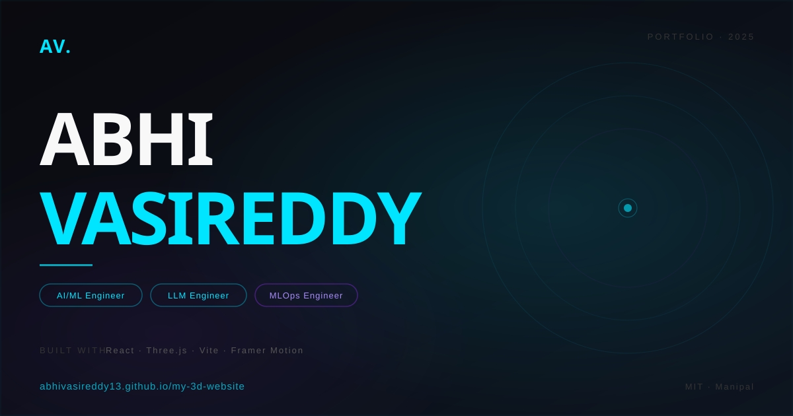

# Abhi Vasireddy — 3D Interactive Portfolio

> Personal portfolio with a real-time 3D character, physics-based skills section, and smooth scroll animations — built with React, Three.js & Vite.

**🔗 Live Site →** [abhivasireddy13.github.io/my-3d-website](https://abhivasireddy13.github.io/my-3d-website/)



---

## ✨ Features

- **Interactive 3D Character** — encrypted GLTF model with idle/typing animations; head tracks mouse in real time
- **Face Portrait Hero** — telephoto camera (fov 14.5, zoom 1.45) frames just the face with monitor hidden
- **Desk View in About** — full-body front-left angle with monitor visible, matching the reference aesthetic
- **Physics Skills Board** — Matter.js 2D rigid-body sim; skill badges bounce and collide
- **Smooth Scroll** — Lenis driver synced with Framer Motion viewport triggers
- **Dark Theme** — `#0a0a0f` base · electric cyan `#00e5ff` accent · purple `#7928ca` fill
- **Responsive** — 3D canvas hidden on mobile, full layout preserved on desktop
- **Auto Deploy** — GitHub Actions builds and deploys to GitHub Pages on every push to `main`

---

## 🛠 Tech Stack

| Layer | Tools |
|---|---|
| Framework | React 19 + Vite 8 |
| 3D / WebGL | Three.js · @react-three/fiber · @react-three/drei |
| Animations | Framer Motion · GSAP · Lenis |
| Physics | Matter.js |
| Styling | Tailwind CSS v4 |
| Deployment | GitHub Pages + GitHub Actions |

---

## 📁 Project Structure

```
Desktop/my-3d-website/
├── public/
│   ├── models/
│   │   ├── character.enc        # AES-CBC encrypted GLTF character model
│   │   └── char_enviorment.hdr  # HDRI environment lighting
│   ├── draco/                   # DRACO mesh decoder
│   └── Abhi_Vasireddy.pdf       # Resume
├── src/
│   ├── components/
│   │   ├── Hero.jsx             # Landing section + 3D face canvas
│   │   ├── About.jsx            # About + desk character view
│   │   ├── Skills.jsx           # Physics skills board
│   │   ├── Projects.jsx         # Project cards
│   │   ├── Experience.jsx       # Career timeline
│   │   ├── Contact.jsx          # Contact form
│   │   └── Navbar.jsx
│   └── three/
│       └── CharacterScene.jsx   # Vanilla Three.js character loader (face + desk modes)
└── .github/workflows/deploy.yml
```

---

## 🚀 Local Development

```bash
git clone https://github.com/abhivasireddy13/my-3d-website.git
cd my-3d-website/Desktop/my-3d-website
npm install
npm run dev        # → http://localhost:5175/my-3d-website/
npm run build      # production build → dist/
```

---

## 👤 About Me

Final-year **B.Tech CSE (AI & ML)** @ Manipal Institute of Technology, graduating 2026.  
Specialising in LLM fine-tuning, RAG pipelines, multi-agent systems & production MLOps.

[](https://linkedin.com/in/abhishek-sai-vasireddy)
[](https://github.com/abhivasireddy13)
[](https://abhivasireddy13.github.io/my-3d-website/)

---

<sub>Built with React + Three.js · Deployed on GitHub Pages</sub>
